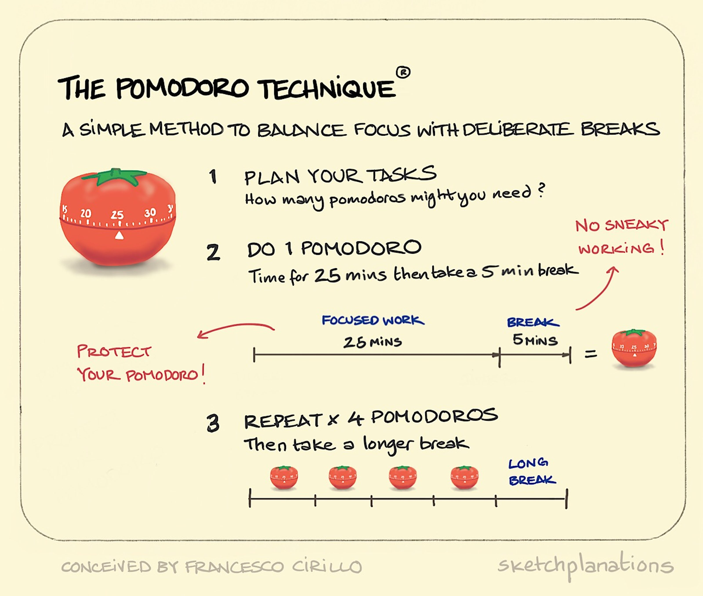

<p align="center"></p>
<h1 align="center"> Animedoro Timer ⏲️📙</h1>
<h2 align="center">version-1️⃣.0️⃣.0️⃣</h2>
Hey ! did you ever feel bad for not concentarting enough? , it's not you're mistake, there is a flaw in your'e study method.

#### Now it's you're time to get good grades, but how? by following POMODORO TECHNIQUE  

## what is Pomodoro technique?
- The Pomodoro Technique is a time management system that encourages people to work with the time they have—rather than against it. Using this method, you break your workday into 25-minute chunks separated by five-minute breaks. These intervals are referred to as pomodoros. After about four pomodoros, you take a longer break of about 15 to 20 minutes.

- The idea behind the technique is that the timer instills a sense of urgency. Rather than feeling like you have endless time in the workday to get things done and then ultimately squandering those precious work hours on distractions, you know you only have 25 minutes to make as much progress on a task as possible.

### Here is a quick illustration:
<p align="center"></p>

### ==> Being said that , i've made my own version of pomodoro timer (coz nothing's free in 21st centuary) which help me track my study time
and it looks like this: 
<p align="center"></p>

### How this thing works:
#### - Intially timer is 00:00, when click on start you'll hear an alarm sound indicating count down has begin. It runs from 25:00
#### - After one 25 min cycle you're again greeted with an alarm sound indicating a short break which runs 5:00
#### - After every successful cycle of work you're granted with a streak (intially streak is 0 , snapchat pls don't sue me 😏)
#### - After 4 cycles of work you're given a long break of 20 mins
audio sounds like this: 

https://user-images.githubusercontent.com/71326149/150498916-0d9d177d-d083-402f-9583-a59bb86ac684.mp4

### note:
- you can reset the timer if you want so, remember you'll loose you're streak
### note-2:
- we will be using the following modules so make sure to install them beforehand

```python
# importing all the required modules and methods 
from tkinter import *
from tkinter import ttk
import time
from cv2 import FONT_HERSHEY_COMPLEX
import math
import pygame
```
- <a href='https://pypi.org/project/pygame/'>pygame</a> is used to play the alarm sound after every cycle , "emergency_alarm.mp3" file is present is src dir
- you can remove the red-border ( <a href='https://github.com/sasivatsal7122/AnimedoroTimer-Tkinter/blob/main/preview/borderless.png'>example</a> ) or even can change to you're liking

And yeah that's it, it took a long time to make this thing look good and functional as required, spent a lot of time on trial and error for adjusting placements of buttons,canvas,streak counter and everything you see and also at the same time making Ui look good, not to mention the googling part since tkinter do not have a proper clear documentation <a href='https://stackoverflow.com/'>stackoverflow</a> helped a lot for widgets to work.

The main intention behind making this timer is to educate newbies how to deal with tkinter, i've written  proper xplaination for each line of code in source, check it <a href='https://github.com/sasivatsal7122/AnimedoroTimer-Tkinter/blob/main/animedoro.py'>here</a> ,  and i'll also post detailed instructions how take make this timer along with other very simple tkinter projects in <a href='https://github.com/sasivatsal7122/learn-tkinter-with-me'>learn-tkinter-with-me</a> repo.

if u like the project give it a star, also check out <a href='https://github.com/sasivatsal7122/learn-tkinter-with-me'>learn-tkinter-with-me</a> repo.

peace ✌️.
